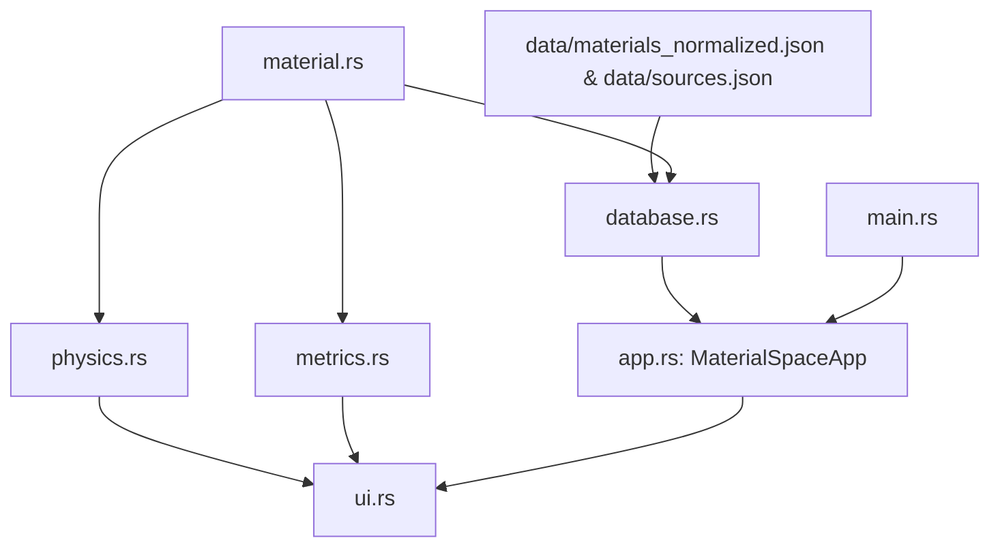

# MaterialSpace Architecture

MaterialSpace is a modular, transparent materials engineering analysis desktop application written in Rust using `eframe` and `egui`.

---

## 1. System Module Structure

```text
src/
├── main.rs       — Application entry point and window bootstrap
├── app.rs        — Central application state and page routing
├── database.rs   — JSON database loading, category indexing, and search
├── material.rs   — Material and Property data structures with provenance
├── physics.rs    — First-principles physics calculations
├── metrics.rs    — Derived engineering metrics, heuristic scores, and rankings
└── ui.rs         — GUI layout, pages, tables, comparison bars, and calculators
```

---

## 2. Module Responsibilities & Flow



### `material.rs`
- Defines `Material`, `Property`, `PropertyValue`, `RawMaterial`, and `SourceInfo`.
- Every property is encapsulated in `Option<Property>`. In accordance with scientific honesty principles, missing property data is never silently replaced with zero.
- Preserves normalized SI values, units, measurement conditions, original values/units, and source references.

### `database.rs`
- Loads `data/materials_normalized.json` and `data/sources.json` at startup.
- Provides case-insensitive substring searching across material Name, ID, Composition, Grade, and Description.
- Provides category list generation and counts for materials with mechanical and thermal datasets.

### `physics.rs`
- Pure, transparent physical calculations:
  - **Linear Thermal Expansion**: $\Delta L = \alpha \cdot L_0 \cdot \Delta T$
  - **Sensible Heat Energy**: $Q = m \cdot c \cdot \Delta T$
  - **1D Fully Constrained Thermal Stress**: $\sigma = E \cdot \alpha \cdot \Delta T$
- Documents physical assumptions explicitly (e.g., isotropic behavior, constant properties over temperature interval, rigid constraints, no structural buckling).

### `metrics.rs`
- Implements derived engineering figures of merit:
  - **Specific Tensile & Yield Strength**: $\sigma / \rho$ ($(\text{N}\cdot\text{m})/\text{kg}$ or $\text{kN}\cdot\text{m}/\text{kg}$)
  - **Specific Stiffness (Modulus)**: $E / \rho$ ($\text{GPa}/(\text{g}/\text{cm}^3)$)
  - **Thermal Diffusivity**: $\alpha = k / (\rho \cdot c_p)$ ($\text{mm}^2/\text{s}$)
  - **Temperature Capability**: Melting / solidus temperature $T_{\text{melt}}$ (K / °C)
  - **Aerospace Suitability Heuristic Score**: Multi-criteria weighted index (0–100) combining specific strength (35%), specific stiffness (25%), temperature capability (20%), density bonus (10%), and thermal conductivity (10%).
  - **Rule-Based Engineering Observations**: Generates qualitative engineering insights based on threshold criteria.
  - **Rankings Engine**: Evaluates and sorts materials across 7 distinct engineering criteria.

### `app.rs`
- Centralized `MaterialSpaceApp` struct holding the active page, database, search query, category filters, selection IDs, and calculator inputs.
- Avoids complex lifetimes and premature optimization by keeping ownership straightforward.

### `ui.rs`
- Implements the immediate-mode GUI with `egui 0.36.x`:
  - `Dashboard`: High-level metrics, dataset status, quick workflows.
  - `Materials Database`: Real-time search, category dropdown, property preview cards.
  - `Compare Materials`: Two-material selector, side-by-side table, visual relative comparison bars.
  - `Material Details`: Full property breakdown, condition, original unit provenance, citations, heuristic metrics, and rule-based observations.
  - `Engineering Rankings`: Dynamic sorting by chosen criteria with relative progress bars.
  - `Physics Calculator`: Real-time interactive calculations with validation.
  - `About & Methodology`: Equations, sources, and scientific disclaimers.

---

## 3. Ownership and GUI Borrowing Design

In immediate-mode GUIs like `egui`, closures often need to read data from the database while mutably modifying application state (e.g. selection indexes, slider values). To ensure code remains beginner-friendly, clean, and safe:
- Search results or active material references needed across closures are cloned on demand.
- No `unsafe` code or complex lifetime annotations are used anywhere in the codebase.
